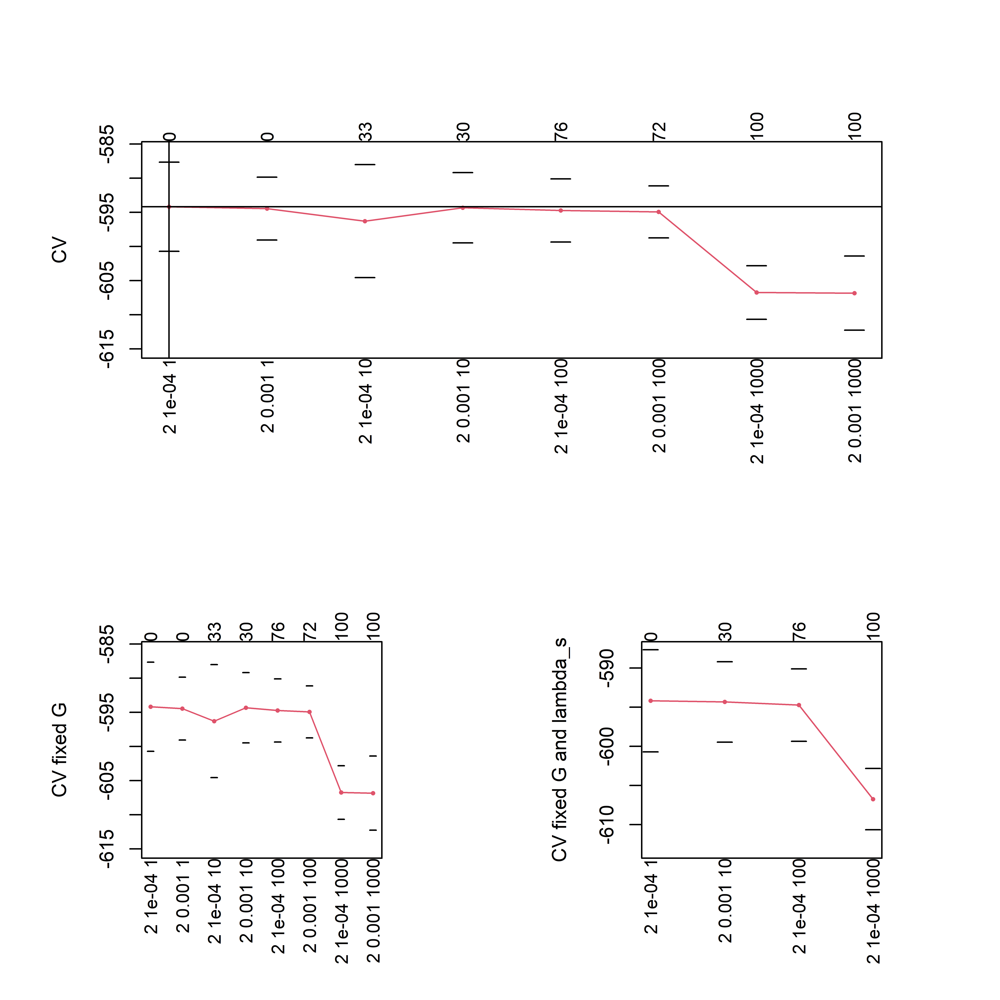
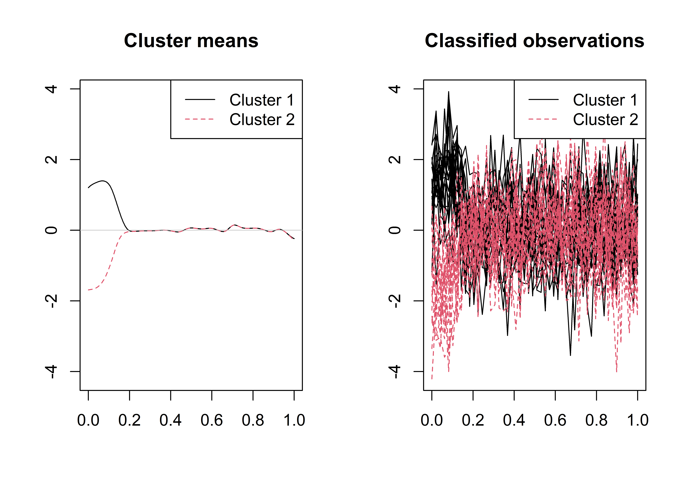

<!-- README.md is generated from README.Rmd. Please edit that file -->

```{r, include = FALSE}
knitr::opts_chunk$set(
  collapse = TRUE,
  comment = "#>",
  fig.path = "man/figures/README-",
  out.width = "100%"
)
library(knitr)    # For knitting document and include_graphics function
library(ggplot2)  # For plotting
library(png)   
```

# sasfunclust 
<!-- badges: start -->
[](https://github.com/unina-sfere/sasfunclust/actions)
[](https://travis-ci.com/unina-sfere/sasfunclust)
<!-- badges: end -->
The package  sasfunclust implements the sparse and smooth functional clustering (SaS-Funclust) method proposed by Centofanti et al. (2021).
SaS-Funclust is a new method for clustering functional data that aims to classify a sample of curves into homogeneous groups while jointly detecting the most informative portions of domain.
The method relies on a general functional Gaussian mixture model whose parameters are estimated by maximizing a log-likelihood function penalized with the functional adaptive pairwise fusion penalty (FAPFP) and a roughness penalty.
The package comprises two main functions \code{sasfclust} and \code{sasfclust_cv}. 
The former performs the SaS-Funclust for fixed number of clusters $G$, tuning parameter of the smoothness penalty $\lambda_s$, and tuning parameter of the FAPFP $\lambda_l$.
The latter executes the K-fold cross-validation procedure  described in Centofanti et al. (2021) to   choose  $G$, $\lambda_s$, and $\lambda_l$.

## Installation

The development version can be installed from [GitHub](https://github.com/) with:

``` r
# install.packages("devtools")
devtools::install_github("unina-sfere/sasfunclust")
```
## Example


This is a basic example which shows you how to apply the two main functions `sasfclust` and `sasfclust_cv` on a synthetic dataset generated as  described in the simulation study of Centofanti et al. (2021).

We start by loading and attaching the sasfunclust package.
```r 
library(sasfunclust)
```

Then, we generate the synthetic dataset as follows.
```r 
n_i=20
train<-simulate_data("Scenario I",n_i=n_i,var_e = 1,var_b = 0.5^2)
```

To apply `sasfclust_cv`,  sequences of $G$, $\lambda_s$, and $\lambda_l$ should be defined.
```r
lambda_s_seq=10^seq(-4,-3)
lambda_l_seq=10^seq(0,3)
G_seq=2
```
And, then, `sasfclust_cv` is executed.
```r
mod_cv<-sasfclust_cv(X=train$X,grid=train$grid,G_seq=G_seq,
lambda_l_seq = lambda_l_seq,lambda_s_seq =lambda_s_seq,maxit = 50,K_fold = 5,q=30,ncores = 7)
```

The results are plotted.
```r
plot(mod_cv)
```
```{r,echo=FALSE}

```
By using the model selection method described in Centofanti et al. (2021), the optimal values of $G$, $\lambda_s$, and $\lambda_l$, are $2$, $10^{-4}$, and $10^2$, respectively.

Finally, `sasfclust` is applied with $G$, $\lambda_s$, and $\lambda_l$ fixed to their optimal values.
```r
mod<-sasfclust(X=train$X,grid=train$grid,G=mod_cv$G_opt,
lambda_l = mod_cv$lambda_l_opt,lambda_s =mod_cv$lambda_s_opt,maxit = 50,q=30)
```
The cluster membership vector and the plot of the estimated cluster mean functions and the classified curves are obtained as follows.
```r
print(mod$clus$classes)
plot(mod)
```

```{r,echo=FALSE}

```

# References

* Centofanti, F., Lepore, A., & Palumbo, B. (2021).
Sparse and Smooth Functional Data Clustering.
*arXiv preprint arXiv:2103.15224*.

