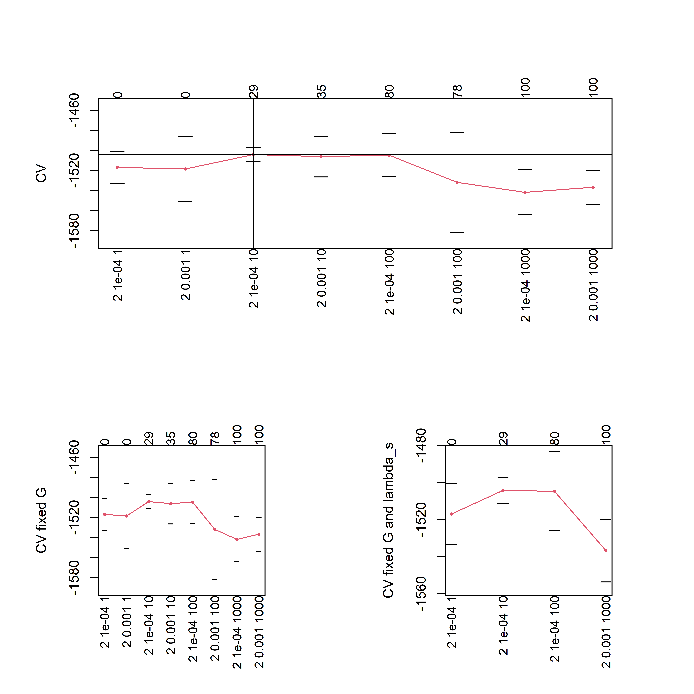
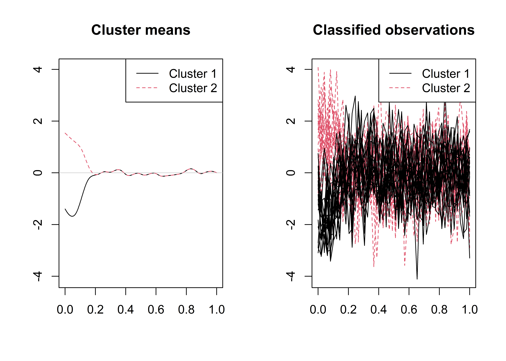

<!-- README.md is generated from README.Rmd. Please edit that file -->

# sasfunclust

<!-- badges: start -->

[](https://github.com/fabiocentofanti/sasfunclust/actions)
[](https://travis-ci.com/fabiocentofanti/sasfunclust)
<!-- badges: end -->

The package sasfunclust implements the the sparse and smooth functional
clustering (SaS-Funclust) method proposed by Centofanti et al. (2021).
SaS-Funclust is a new method for clustering functional data that aims to
classify a sample of curves into homogeneous groups while jointly
detecting the most informative portions of domain. The method relies on
a general functional Gaussian mixture model whose parameters are
estimated by maximizing a log-likelihood function penalized with the
functional adaptive pairwise fusion penalty (FAPFP) and a roughness
penalty. The package comprises two main functions and . The former
performs the SaS-Funclust for fixed number of clusters *G*, tuning
parameter of the smoothness penalty *λ*<sub>*s*</sub>, and tuning
parameter of the FAPFP *λ*<sub>*l*</sub>. The latter executes the K-fold
cross-validation procedure described in Centofanti et al. (2021) to
choose *G*, *λ*<sub>*s*</sub>, and *λ*<sub>*l*</sub>.

## Installation

The development version can be installed from
[GitHub](https://github.com/) with:

``` r
# install.packages("devtools")
devtools::install_github("unina-sfere/sasfunclust")
```

## Example

This is a basic example which shows you how to apply the two main
functions `sasfclust` and `sasfclust_cv` on a synthetic dataset
generated as described in the simulation study of Centofanti et
al. (2021).

We start by loading and attaching the sasfunclust package.

``` r
library(sasfunclust)
#> 
#> Attaching package: 'sasfunclust'
#> The following object is masked from 'package:graphics':
#> 
#>     plot
#> The following object is masked from 'package:base':
#> 
#>     plot
```

Then, we generate the synthetic dataset as follows.

``` r
n_i=20
train<-simulate_data("Scenario I",n_i=n_i,var_e = 1,var_b = 0.5^2)
```

To apply `sasfclust_cv`, sequences of *G*, *λ*<sub>*s*</sub>, and
*λ*<sub>*l*</sub> should be defined.

``` r
lambda_s_seq=10^seq(-4,-3)
lambda_l_seq=10^seq(0,3)
G_seq=2
```

And, then, `sasfclust_cv` is executed.

``` r
mod_cv<-sasfclust_cv(X=train$X,grid=train$grid,G_seq=G_seq,
lambda_l_seq = lambda_l_seq,lambda_s_seq =lambda_s_seq,maxit = 200,K_fold = 2,q=30)
```

The results are plotted.

``` r
plot(mod_cv)
```

 By
using the model selection method described in Centofanti et al. (2021),
the optimal values of *G*, *λ*<sub>*s*</sub>, and *λ*<sub>*l*</sub>, are
2, 10<sup> − 4</sup>, and 10<sup>2</sup>, respectively.

Finally, `sasfclust` is applied with *G*, *λ*<sub>*s*</sub>, and
*λ*<sub>*l*</sub> fixed to their optimal values.

``` r
mod<-sasfclust(X=train$X,grid=train$grid,G=mod_cv$G_opt,
lambda_l = mod_cv$lambda_l_opt,lambda_s =mod_cv$lambda_s_opt,maxit = 200,q=30)
```

The cluster membership vector and the plot of the estimated cluster mean
functions and the classified curves are obtained as follows.

``` r
print(mod$clus$classes)
#>  [1] 2 2 2 2 2 2 2 2 2 2 2 2 2 2 2 2 2 2 2 2 1 1 1 1 1 1 1 1 1 1 1 1 1 1 1 1 1 1
#> [39] 1 1
plot(mod)
```

 \#
References
